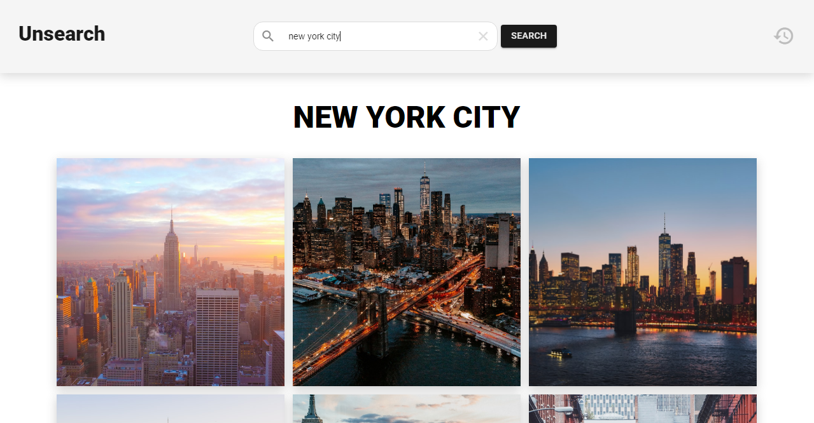
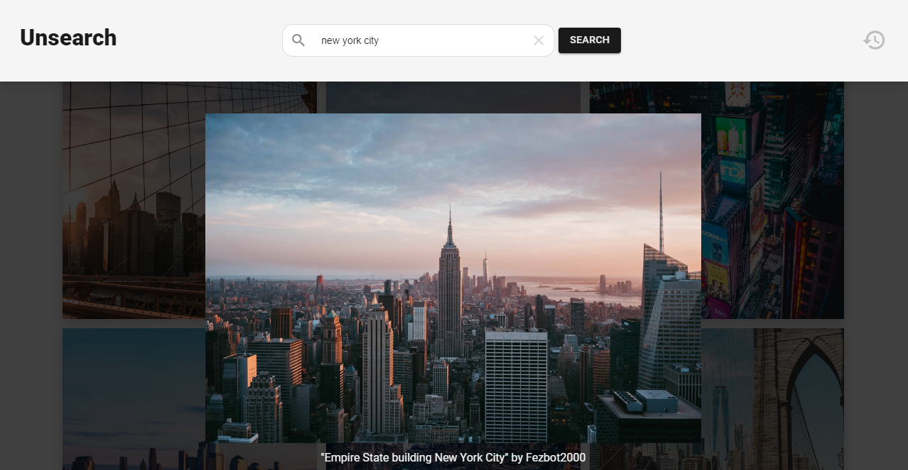
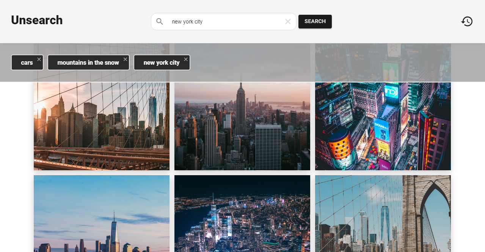

# React Image Search app

An Image Search app created using **React** + **Hooks** + **Typescript** + **Unsplash API**

Try it live: https://unsearch.netlify.com/

## Features

## To run the app with React

1. Run `npm install`
2. Run `npm start`
3. Open the app in `http://localhost:3000`
4. `Note:` You will need a clientID (AccessKey) from Unsplash.

