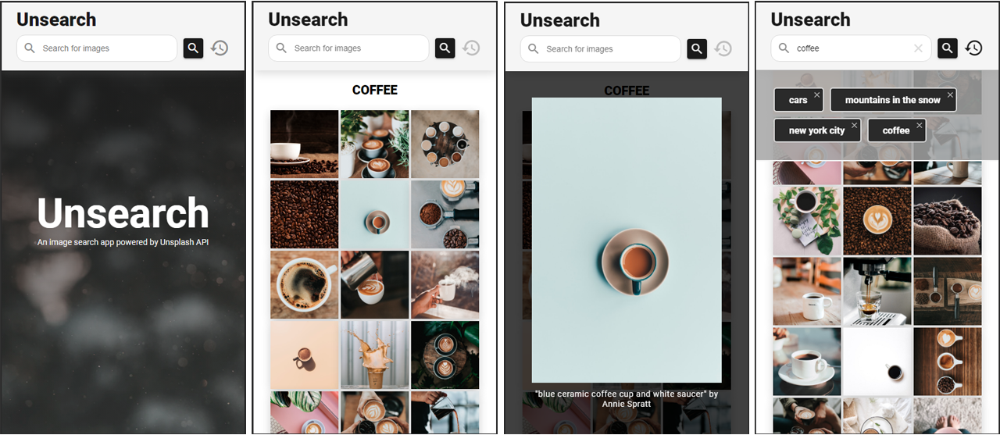

# React Image Search app

An Image Search app created using **React** + **Hooks** + **Typescript**  + **Material UI** + **Unsplash API**

Try it live: https://unsearch.netlify.com/

## Features

- Search for free high-resolution photos by entered keywords
- Get up to 30 images back for your query
- Preview selected images in their original ratio
- See author's name and photo description
- Search images by your previously entered keywords using history feature
- Successful searches are saved to history automatically
- Remove unwanted items from history or Search Again by just clicking them
- Responsive layout fitting different size devices

## To run the app with React

1. Run `npm install`
2. Run `npm start`
3. Open the app in `http://localhost:3000`
4. `Note:` You will need a clientID (AccessKey) from Unsplash.

